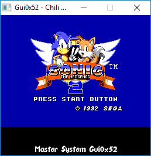
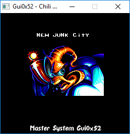
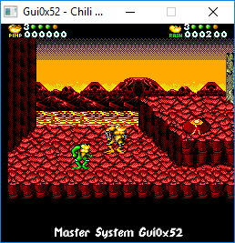
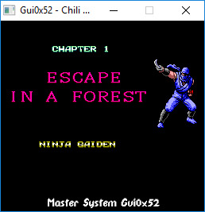
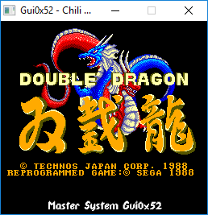
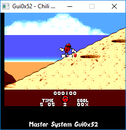
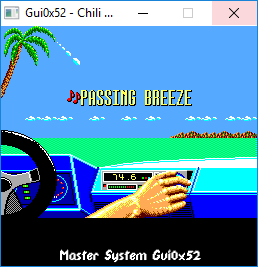
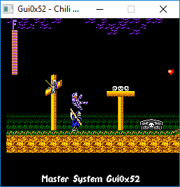

# Gui0x52
```bash
                                                ,----,                     
          ____                                ,/   .`|                     
        ,'  , `.   ,---,       .--.--.      ,`   .'  :   ,---,.,-.----.    
     ,-+-,.' _ |  '  .' \     /  /    '.  ;    ;     / ,'  .' |\    /  \   
  ,-+-. ;   , || /  ;    '.  |  :  /`. /.'___,/    ,',---.'   |;   :    \  
 ,--.'|'   |  ;|:  :       \ ;  |  |--` |    :     | |   |   .'|   | .\ :  
|   |  ,', |  '::  |   /\   \|  :  ;_   ;    |.';  ; :   :  |-,.   : |: |  Programmed by 
|   | /  | |  |||  :  ' ;.   :\  \    `.`----'  |  | :   |  ;/||   |  \ :  Julien Magnin (MS-DOS1999)
'   | :  | :  |,|  |  ;/  \   \`----.   \   '   :  ; |   :   .'|   : .  /  
;   . |  ; |--' '  :  | \  \ ,'__ \  \  |   |   |  ' |   |  |-,;   | |  \  
|   : |  | ,    |  |  '  '--' /  /`--'  /   '   :  | '   :  ;/||   | ;\  \ 
|   : '  |/     |  :  :      '--'.     /    ;   |.'  |   |    \:   ' | \.' 
;   | |`-'      |  | ,'        `--'---'     '---'    |   :   .':   : :-'   
|   ;/          `--''                                |   | ,'  |   |.'     
'---'                                    ,----,      `----'    `---'       
     Gui0x52   Emulator                ,/   .`|                   ____     
  .--.--.               .--.--.      ,`   .'  :   ,---,.        ,'  , `.   
 /  /    '.      ,---, /  /    '.  ;    ;     / ,'  .' |     ,-+-,.' _ |   
|  :  /`. /     /_ ./||  :  /`. /.'___,/    ,',---.'   |  ,-+-. ;   , ||   
;  |  |--`,---, |  ' :;  |  |--` |    :     | |   |   .' ,--.'|'   |  ;|   
|  :  ;_ /___/ \.  : ||  :  ;_   ;    |.';  ; :   :  |-,|   |  ,', |  ':   
 \  \    `.  \  \ ,' ' \  \    `.`----'  |  | :   |  ;/||   | /  | |  ||   
  `----.   \  ;  `  ,'  `----.   \   '   :  ; |   :   .''   | :  | :  |,   
  __ \  \  |\  \    '   __ \  \  |   |   |  ' |   |  |-,;   . |  ; |--'    
 /  /`--'  / '  \   |  /  /`--'  /   '   :  | '   :  ;/||   : |  | ,       
'--'.     /   \  ;  ; '--'.     /    ;   |.'  |   |    \|   : '  |/        
  `--'---'     :  \  \  `--'---'     '---'    |   :   .';   | |`-'         
                \  ' ;                        |   | ,'  |   ;/             
                 `--`                         `----'    '---'                                                                                 
 ```

Gui0x52 is a Windows Sega Master System emulator written in C/SFML.
The emulator can run the majority of SMS games but does not have Sound Emulation.



## Installation

Download the [latest release]() of Gui0x52 from the releases page.

### Building from source

Download or clone this repo, and run:
```sh
git clone https://github.com/MS-DOS1999/Master-System-Emu_Gui0x52.git
cd Master-System-Emu_Gui0x52
compile.bat
```
You need Gcc MinGW
And CSFML lib

Gui0x52 is compatible only on Windows

## Usage

Just launch Gui0x52.exe and select your favorite game

Other options:

  You can go in Config/ and change values in config.txt

## Joypad/Input

-Player 1 :<br/>
<kbd>Z</kbd> - Up<br/>
<kbd>Q</kbd> - Left<br/>
<kbd>S</kbd> - Down<br/>
<kbd>D</kbd> - Right<br/>
<kbd>K</kbd> - 1 Start<br/>
<kbd>L</kbd> - 2<br/>
<br/>
-Player 2 :<br/>
<kbd>↑</kbd> - Up<br/>
<kbd>←</kbd> - Left<br/>
<kbd>↓</kbd> - Down<br/>
<kbd>→</kbd> - Right<br/>
<kbd>Numpad 2</kbd> - 1 Start<br/>
<kbd>Numpad 3</kbd> - 2<br/>
<br/>
-Emulator :<br/>
<kbd>SpaceBar</kbd> - Reset<br/>
<kbd>Esc</kbd> - Quit Emulator<br/>
<br/>



### Saving 
A `<rom-name>.sav` (e.g. `Phantasy Star.sav`) file will be created at Emulator exit.
If Save file exist, it automatically loaded when Gui0x52 is launched.

## Testing
Gui0x52 currently passes all of the tests in `zexdoc` test rom.



## Resources
Resources were used to understand and test the Master System hardware. Some of these include:
* <http://www.codeslinger.co.uk/pages/projects/mastersystem/resources.html>
* <http://clrhome.org/table/>
* <http://www.smspower.org/Development/Documents>